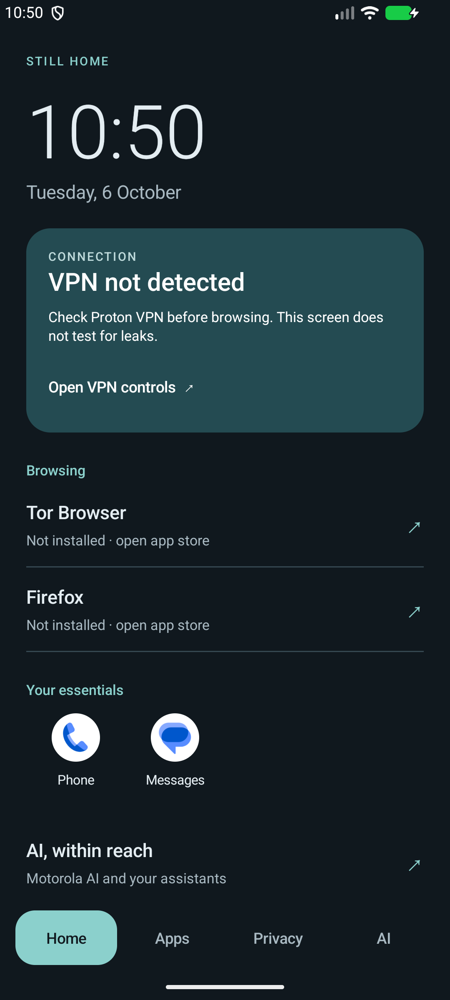

# Still Home

A small, open-source Android launcher with a dark home screen, local app search,
privacy settings shortcuts, and access to existing AI assistants.

Still Home works without Internet permission. It has no accounts, ads, analytics,
tracking SDKs, or bundled third-party libraries. It is an early personal project,
not an independently audited security product or a replacement operating system.

[Download the latest release](https://github.com/sampathmannam/still-home/releases/latest)
· [Privacy](PRIVACY.md) · [App replacement guide](docs/APP-REPLACEMENTS.md)

## Features

- Dark appearance by default; choose Dark, Light, or System in **Privacy → Appearance**.
- Home screen with a clock, browsing shortcuts, essentials, and an AI section.
- App drawer with local search and long-press access to Android app settings.
- Android-reported VPN connection, screen-lock status, and security-patch date.
- Shortcuts to Android's VPN, permissions, location, advertising, and update controls.
- Launch existing Motorola Qira/Moto AI, ChatGPT, Grok, and installed PocketPal AI.
- Shortcuts to compatible installed open-source apps.



*Emulator preview: installed apps and connection status differ on each phone.*

## Install

Requires Android 11 or later. Download `StillHome.apk` from this repository's
release page and install it using Android's package installer. Permit installation
from that source only for the installation if Android asks. Open Still Home, then
choose **Privacy → Choose your home app**.

Retain your original launcher. To switch back, open Android **Settings → Apps →
Default apps → Home app**. This app does not root, unlock, flash, or wipe a phone.
It cannot silently install other apps or change their permissions.

Theme changes apply to Still Home. Use Android's display settings and each app's
appearance settings for dark mode elsewhere. Widgets, work-profile app discovery,
and private-space integration are not implemented.

## Privacy and security scope

The sole requested permission is `android.permission.ACCESS_NETWORK_STATE`.
App names/icons and search text are handled on the device. Search is not retained;
the theme preference is stored locally. Android cloud backup is disabled for this
app. Other apps opened from the launcher retain their own permissions and policies.

**VPN detected** means Android reports a VPN transport on the active connection.
It does not verify the public IP, DNS leaks, routing for every app, or a kill switch.
A skin or launcher does not add GrapheneOS kernel hardening, sandboxed Google Play,
firmware updates, or anonymity. Cloud assistants receive submitted content.

## Build

Install Python 3, JDK 17 or newer, Android SDK platform `android-36`, and Android
build tools `36.1.0`. Set `ANDROID_SDK_ROOT` and `JAVA_HOME`, then run:

```sh
python3 build.py --build-dir build --signing-dir /private/path/still-home-signing --output dist/StillHome.apk
```

The build script uses local SDK tools and downloads no dependencies. Installing
the SDK/JDK and running hosted CI require network access. The signing directory
contains a private key and password; keep it outside this repository and retain it
for compatible updates. A locally generated key differs from the published release
key. CI uses a disposable key, never the release key, and does not publish an APK.

[Verification notes](docs/VERIFICATION.md) describe what has been tested. Build
success is not a security audit. Binary reproducibility has not been established.

## License

[MIT](LICENSE.txt). Android SDK tools and external apps have their own licenses.
App icons are loaded from installed apps and are not bundled with this project.
