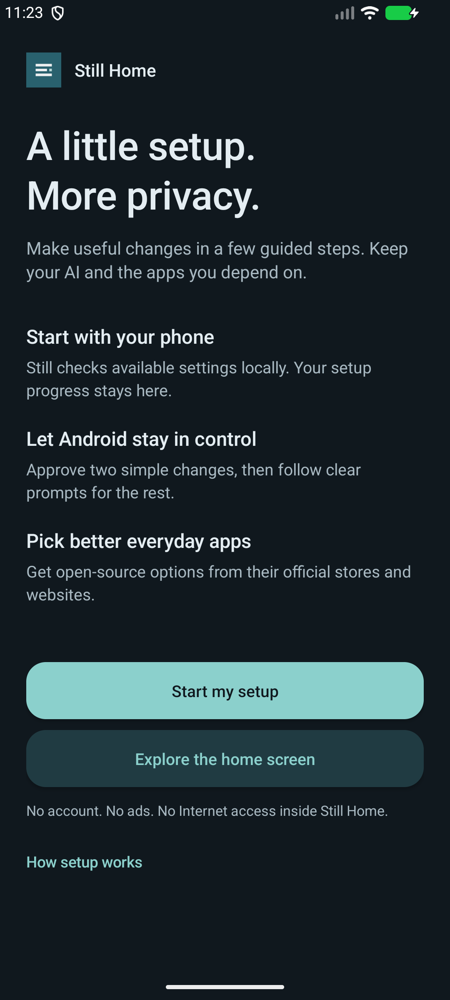

# Still Home

An offline Android launcher that guides you through a more private phone setup.
It keeps existing AI features available and helps you choose privacy-focused apps.

[Download the latest release](https://github.com/sampathmannam/still-home/releases/latest)
· [Privacy policy](PRIVACY.md) · [How automation works](docs/AUTOMATION.md)
· [App choices](docs/APP-REPLACEMENTS.md)

## Guided setup

Version 2.0 replaces the settings-link list with a six-step setup:

1. **Quick defaults:** after Android's consent, shorten the screen timeout to one
   minute without lengthening an existing shorter timeout, and disable brief
   password-character previews in supported fields.
2. **Connection:** open Proton VPN and review Android's always-on/blocking controls.
3. **Typing:** get, enable, and choose HeliBoard using Android's keyboard controls.
4. **Everyday apps:** see installed starter apps and a catalog of official sources.
5. **Android controls:** review lock-screen privacy, permissions, ads, and updates.
6. **AI and home:** keep assistants available, explore on-device AI, and choose a launcher.

Progress stays on the phone. Live checks are distinct from review notes the user
marks themselves. Skipping a step never labels it protected. Returning from settings
refreshes checks, and the summary identifies unfinished items.



*Android emulator preview; actual status and installed apps depend on the phone.*

## What is automatic?

| Feature | Behavior |
| --- | --- |
| Local setup checks | Run when the app opens or returns to the foreground. |
| Dark appearance | Default for Still Home; Light and System are also available. |
| Recent-app preview | Disabled for Still Home on Android 13+; normal screenshots still work. |
| Timeout and password previews | Apply only after the user chooses Apply and grants Android's special settings access. Read back to confirm. |
| Undo | Restores recorded values only when the current value still matches what Still applied. Newer user choices are preserved. |
| VPN, keyboard, app defaults, permissions | Guided Android confirmations; these are not silently changed. |
| App installation | Opens official store/project destinations; the store or Android installer handles confirmation and updates. |

Installation alone does not configure the phone or start a background service.
**Open Still Home and choose Start my setup.** Android intentionally restricts
ordinary apps from silently changing privileged settings. No root, accessibility
automation, device-owner enrollment, ADB grant, or factory reset is required.

The screen timeout is separate from lock delay. Android values changed by Still
remain after uninstalling; use Undo first if you want the previous values back.

## Install and use

Download `StillHome.apk` from this repository's release page. Requires Android 11+.
Install using Android's package installer, permitting that source if prompted, then
open the app. Existing installations using the release key can update in place.

Still Home can guide setup without becoming the default launcher. To use it as your
home screen, choose **Setup → AI and your home → Choose your home app**. Keep your
original launcher; switch back using Android **Settings → Apps → Default apps → Home app**.

The app includes local app search, app-info shortcuts, dark/light/system themes,
phone/tablet navigation, and existing Motorola Qira/Moto AI, ChatGPT, Grok, and
PocketPal shortcuts when those apps are available. Widgets, work-profile app
integration, and private-space integration are not implemented.

## Privacy boundaries

No Internet permission, ads, accounts, analytics, tracking SDKs, or third-party app
libraries. Android cloud backup is disabled. Two permissions are declared:

- `ACCESS_NETWORK_STATE` reads Android's active network status.
- `WRITE_SETTINGS` is optional special access, granted in Android's own screen.
  The implementation writes only screen timeout and password-character previews.

VPN detection is not a public-IP/DNS leak test or proof of always-on blocking.
Open-source apps can still use account syncing, backups, or external services.
Cloud assistants receive submitted content. A launcher does not provide GrapheneOS
hardening or make a phone unhackable. This is an early project without an independent
security audit. See the [research and API boundaries](docs/AUTOMATION.md).

## Build and checks

Use Python 3, JDK 17+, Android SDK platform `android-36`, and build tools `36.1.0`.
Set `ANDROID_SDK_ROOT` and `JAVA_HOME`:

```sh
python3 tests/run.py
python3 build.py --build-dir build --signing-dir /private/path/still-home-signing --output dist/StillHome.apk
```

The build script downloads no dependencies. SDK setup and hosted CI need network
access. Keep the signing key/password outside the repository and retain them for
compatible updates. Hosted CI uses a disposable key and checks the packaged permission
boundary; it does not publish that APK. Reproducible binaries have not been established.

[Verification notes](docs/VERIFICATION.md) distinguish emulator checks from device testing.

## License

[MIT](LICENSE.txt). SDK tools and external apps retain their own licenses. App icons
are loaded from installed apps, not bundled as part of the project.
